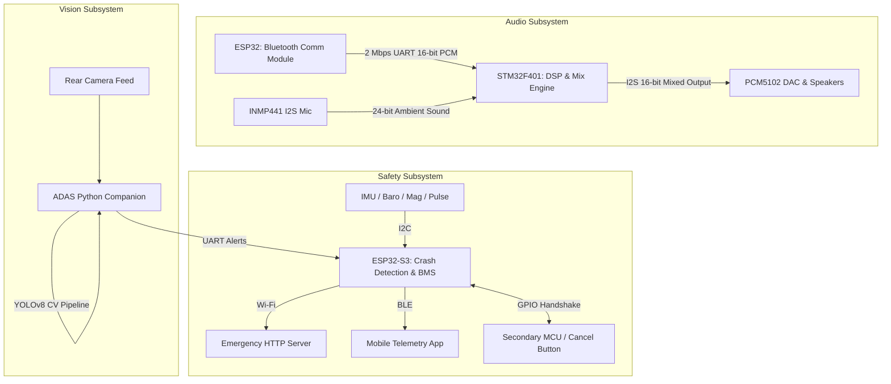

# 🏍️ Smart Helmet System: The Ultimate Connected Riding Experience


Welcome to the **Smart Helmet System**—an advanced, multi-MCU embedded project engineered to push the boundaries of motorcycle safety and rider experience. This is not just a Bluetooth headset; this is a highly distributed, real-time computational node worn on the head.

By fusing **Real-Time Digital Signal Processing (DSP)**, **Advanced Machine Learning (YOLOv8)**, and **Multi-Sensor Telemetry (IMU, Barometer, Magnetometer, Pulse)**, this project serves as a masterclass in modern embedded systems architecture, RTOS management, and Edge AI.

---

## 🌟 Core Features

- 🎧 **High-Fidelity Audio & ANC**: True Stereo 16-bit A2DP Bluetooth streaming mixed with real-time Active Noise Cancellation (ANC) and Transparency modes powered by an STM32 DSP.
- 💥 **Autonomous Crash Detection**: 100Hz multi-sensor fusion (IMU, Barometer, Magnetometer) utilizing FreeRTOS to detect high-G impacts, falls, and collisions with zero false positives.
- 🚑 **SOS Alert System**: Automatic Wi-Fi HTTP dispatch to an emergency server with live vitals (Heart Rate & Body Temperature) when a crash is uncancelled.
- 👁️ **ADAS (Advanced Driver Assistance System)**: Real-time YOLOv8 computer vision pipeline tracking the distance and approach vectors of vehicles in the blind spots, providing instantaneous collision warnings.
- 🔋 **Robust Power Management**: Custom BMS integration with real-time OLED telemetry and BLE GATT broadcasting.

---

## 🏗️ System Architecture

To achieve hard real-time constraints and parallel processing, the system is decentralized across multiple specialized computing units:



### 1. The DSP & Audio Engine (STM32F401CCU6 Black Pill)
The heart of the auditory experience. It handles rigorous digital signal processing without missing a single sample.
- **Data Acquisition**: Utilizes Circular DMA for zero-CPU-overhead data streaming. Receives True Stereo A2DP from the ESP32 via UART, and simultaneously captures 24-bit ambient audio from the INMP441 via I2S.
- **Ping-Pong Buffering**: Employs half-transfer and full-transfer interrupts to execute the `BufferManager_Process()` loop, ensuring continuous, glitch-free audio processing.
- **Real-Time Mixing**: 
  - *Transparency Mode*: Injects normalized ambient audio directly into the stereo stream, keeping the rider acutely aware of their surroundings.
  - *ANC Mode*: Phase-inverts the ambient noise waveform, destructively interfering with road and wind noise.
- **Location**: `STM32 ANC Module/` (Built with STM32CubeIDE & HAL)

### 2. The Bluetooth Comm Module (ESP32)
Dedicated entirely to maintaining a flawless Classic Bluetooth A2DP connection.
- **Function**: Acts as a high-quality A2DP sink.
- **Output**: Extracts the PCM payload and blasts interleaved 16-bit True Stereo audio over a blazing fast **2 Mbps UART** link directly to the STM32's DMA buffers.
- **Location**: `Communication Module ESP32/` (Built with ESP-IDF)

### 3. Crash Detection & Telemetry (Seeed XIAO ESP32S3)
A marvel of embedded RTOS design. Runs **7 concurrent FreeRTOS tasks** synchronized via mutexes and queues to monitor the rider's physical state.
- **Sensor Fusion Engine**: 
  - **IMU (LSM6DSO)**: Polled at 100Hz to catch high-G (>14g) transient shocks.
  - **Barometer (BMP581)**: Monitors sudden altitude drops indicative of a rider falling off the bike.
  - **Magnetometer (MMC56X3)**: Detects severe magnetic anomalies from metal-on-metal vehicular collisions.
- **Vitals Monitoring**: Live BPM reading from a MAX30102 pulse oximeter and skin temperature from a TMP117.
- **Fail-Safe SOS Logic**: A Supervisor task correlates sensor flags. If an impact is followed by stillness, it triggers a 10-second countdown. If the rider doesn't cancel the alarm via a GPIO handshake from a secondary button, the ESP32-S3 establishes a Wi-Fi connection (provisioned via EspTouch SmartConfig) and fires a JSON payload to an SOS REST API.
- **Location**: `CrashDetection_ESP32S3/` (Built with ESP-IDF v6.0.1)

### 4. Advanced Driver Assistance System (ADAS)
Bringing automotive-grade active safety to the motorcycle helmet.
- **Computer Vision**: Leverages the **Ultralytics YOLOv8** neural network to perform real-time object tracking on a rear-facing camera feed.
- **Spatial Awareness**: Evaluates bounding box dynamics to estimate absolute distance. A mathematically defined central triangle mask determines if a vehicle is approaching directly from behind, or passing on the left/right.
- **Preemptive Alerts**: Triggers immediate serial warnings ("L", "R", "B") to the helmet MCU before a vehicle enters the rider's blind spot.
- **Location**: `ADAS/` (Python, OpenCV)

---

## 🔌 Hardware Pinouts & Wiring

### DSP & ANC Module (STM32F401CCU6)
| Component | Function | STM32 Pin |
| :--- | :--- | :--- |
| **ESP32 Comm Module** | UART TX (Audio Stream) | `PA10` (UART1 RX) |
| **INMP441 Mic** | I2S WS (Word Select) | `PB12` (I2S2 WS) |
| | I2S SCK (Clock) | `PB13` (I2S2 SCK) |
| | I2S SD (Data) | `PB15` (I2S2 SD) |
| **PCM5102 DAC** | I2S WS | `PA4` (I2S3 WS) |
| | I2S SCK | `PB3` (I2S3 SCK) |
| | I2S SD | `PB5` (I2S3 SD) |
| **Push Button** | Toggle ANC / Transparency | `PA0` (Internal Pull-Up) |

*(Note: The STM32 hardware configuration for Clocks, GPIO, DMA, UART, and I2S is written bare-metal / HAL in `audio_pipeline.c`. Regenerating code using the `.ioc` file is not strictly necessary and may overwrite custom configurations.)*

### Crash Detection Module (ESP32-S3)
- **I2C Bus** (`SDA: D4`, `SCL: D5`): Shared among IMU, Barometer, Magnetometer, Pulse, Temp, and OLED.
- **ADC** (`D3`): Reading a 2S Li-ion battery via a 4.0x voltage divider for precise BMS telemetry.
- **GPIO Handshake** (`TX: D1`, `RX: D2`): For the crash cancellation switch communicating with a secondary MCU.

---

## 🚀 Getting Started & Building

This project utilizes professional-grade build systems. Ensure you have the respective toolchains installed.

### 1. Building the ESP32 Comm Module
Requires ESP-IDF v5.x.
```bash
cd "Communication Module ESP32"
idf.py build
idf.py -p (PORT) flash monitor
```

### 2. Building the STM32 DSP Module
1. Open **STM32CubeIDE**.
2. Select `File -> Import -> General -> Existing Projects into Workspace`.
3. Select the `STM32 ANC Module` directory.
4. Click the **Build** (hammer) icon.
5. Flash to the Black Pill using an ST-Link v2.

### 3. Building the Crash Detection System
Requires ESP-IDF v6.0.1.
```bash
cd "CrashDetection_ESP32S3"
idf.py set-target esp32s3
idf.py build
idf.py -p (PORT) flash monitor
```
*(On first boot, use the EspTouch mobile app to provision the Wi-Fi credentials via SmartConfig).*

### 4. Running the ADAS Vision Pipeline
```bash
cd ADAS
python3 -m venv .venv
source .venv/bin/activate
pip install opencv-python numpy ultralytics
python script_no_hardware.py
```

---

## 📜 License
This project is open-source. Feel free to explore, modify, and integrate these advanced engineering patterns into your own safety-critical applications.
