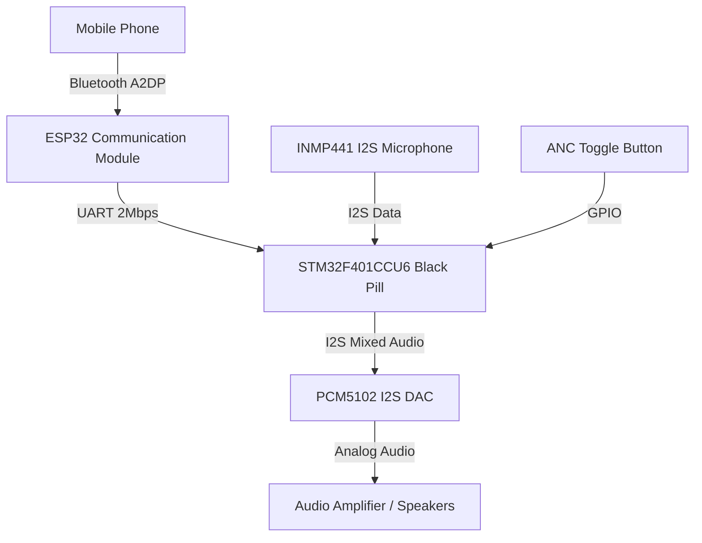

# Smart Helmet Circuit Diagram & Wiring Guide

This document outlines the hardware connections required to build the Smart Helmet System, linking the ESP32 (Bluetooth Audio Receiver) with the STM32F401CCU6 (DSP/ANC Module).

## System Architecture

## Detailed Pin Mappings

### 1. ESP32 to STM32 (High-Speed UART)
Used to transmit the decoded A2DP stereo audio to the DSP module.

| ESP32 Pin | STM32F401 Pin | Function |
| :--- | :--- | :--- |
| `GPIO17` (TX2) | `PA10` (UART1 RX) | High-speed (2 Mbps) audio stream |
| `GND` | `GND` | Common Ground Reference |

### 2. INMP441 Microphone to STM32 (Ambient Noise Input)
Used to capture environmental noise for Transparency Mode and ANC.

| INMP441 Pin | STM32F401 Pin | Function |
| :--- | :--- | :--- |
| `VDD` | `3.3V` | Power supply |
| `GND` | `GND` | Ground |
| `L/R` | `GND` | Sets mic to output on Left Channel |
| `WS` | `PB12` (I2S2 WS) | Word Select (Left/Right Clock) |
| `SCK` | `PB13` (I2S2 SCK) | Serial Clock |
| `SD` | `PB15` (I2S2 SD) | Serial Data Output |

### 3. PCM5102 DAC to STM32 (Speaker Output)
Used to convert the mixed digital I2S signal back into analog audio for the speakers.

| PCM5102 Pin | STM32F401 Pin | Function |
| :--- | :--- | :--- |
| `VIN` | `5V` (or `3.3V`) | Power supply |
| `GND` | `GND` | Ground |
| `LCK` | `PA4` (I2S3 WS) | Word Select (Left/Right Clock) |
| `BCK` | `PB3` (I2S3 SCK) | Bit Clock |
| `DIN` | `PB5` (I2S3 SD) | Data Input |
| `SCK` | `GND` | System Clock (GND enables internal PLL on PCM5102) |

### 4. ANC Toggle Button
Used to switch between Transparency Mode (hear surroundings) and ANC Mode (cancel noise).

| Button Pin 1 | Button Pin 2 | Function |
| :--- | :--- | :--- |
| `PA0` | `GND` | Triggers EXTI interrupt on Falling Edge. STM32 configures internal Pull-Up. |

## Power Considerations
1. **Common Ground:** Ensure that the ESP32, STM32, Microphone, and DAC all share a common ground line to prevent noise and data corruption.
2. **Voltage Levels:** The STM32F401 and ESP32 are both 3.3V logic devices, so the UART and I2S lines can be connected directly without level shifters.
3. **Audio Ground Loop:** If you use an external amplifier after the DAC, ensure it is properly isolated if powered from the same battery to avoid ground loop hum.
